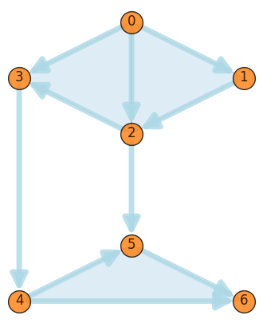
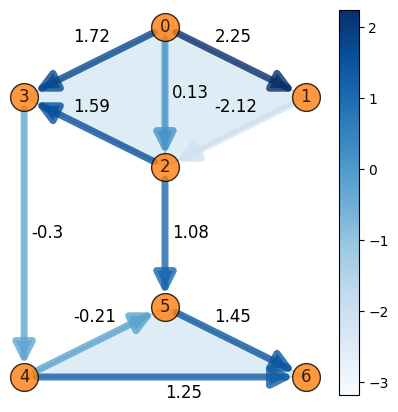

PyTSPL: Topological Signal Processing and Learning in Python
============================================================

.. image:: https://readthedocs.org/projects/pytspl/badge/?version=latest
    :target: https://pytspl.readthedocs.io/en/latest/?badge=latest
    :alt: Documentation Status

.. image:: https://img.shields.io/pypi/v/pytspl.svg
   :target: https://pypi.org/project/pytspl
    :alt: PyPI

.. image:: https://github.com/irtazahashmi/pytspl/actions/workflows/onpush.yml/badge.svg
   :target: https://github.com/irtazahashmi/pytspl/actions/workflows/onpush.yml
    :alt: Build Status

.. image:: https://codecov.io/gh/irtazahashmi/pytspl/graph/badge.svg?token=7KQ0U8FW70
   :target: https://codecov.io/gh/irtazahashmi/pytspl
    :alt: Code Coverage

.. image:: https://img.shields.io/pypi/l/pytspl.svg
   :target: https://github.com/irtazahashmi/pytspl/blob/dev/LICENSE
   :alt: License

.. image:: https://img.shields.io/badge/python-3.11+-blue?logo=python
   :target: https://www.python.org/
    :alt: Python Version

The PyTSPL python package is a library for Topological Signal Processing and Learning. It is a 
free software distributed under the MIT license and available on PyPI. The documentation is available
on `Read the Docs <https://pytspl.readthedocs.io/en/latest/>`_ and development takes place on
`GitHub <https://github.com/irtazahashmi/pytspl>`_.

The primary goal of ``PyTSPL`` is to provide a unified and comprehensive toolset for the analysis and
visualization of higher-order interactions, currently centered towards simplical complexes (SCs). The 
functionalities of SCs are scattered and it’s difficult to use multiple functionalities together. By 
integrating multiple functionalities within a single library and extending them, PyTSPL aims to facilitate 
research and practical applications in various domains.

Currently, the PyTSPL facilitates the functionalities for SCs but the aim is to
extend the library for additional topological learning functionalities. 

**Simlicial complexes (SC):**

- ``io``: Responsible for reading raw datasets and preprocessing them such that they can be passed on to 
  the next module to build an SC. The raw datasets can be read using the `network_reader` submodule.
  The data can be in various formats such as CSV, TNTP or plain incidence matrices B1 and B2. There
  is additional functionality to read the coordinates and edge flow of the SC as well. Additionally, there
  is functionality to load built-in datasets using the `dataset_loader` submodule. Finally, there is also a 
  quick way to generate a random SC using the `sc_generator` submodule.

- ``simplicial_complex``: Once the raw data is read using the `io` module, it is stored in the 
  `simplicial_complex` data structure. This data structure allows us to compute the algebraic properties 
  of the SC.  This includes computing the incidence matrix, adjacency matrix, Laplacian matrices and many
  others. It also allows for the computation of k-step lower and upper shifting and simplical embeddings
  of the SC.

- ``plot``: Offers the functionality to plot an SC in a quick and meaningful way. The user can draw the entire 
  network or draw nodes, edges, and their respective labels in a custom way that meets their needs. The plots 
  are drawn using the provided network coordinates. If the coordinates are not provided or don’t exist, the 
  module automatically generates coordinates using NetworkX’s `spring_layout`.

- ``decomposition``: Offers functionality to decompose signals using eigendecomposition and Hodge decomposition. 
  The eigendecomposition functionality allows users to extract the gradient, harmonic, and curl eigenpairs, 
  whereas the Hodge decomposition allows users to obtain the divergence, curl, total variance of the SC. The 
  gradient, harmonic, and curl flow can also be calculated.

- ``filters``: This module aims to provide simplicial convolutional filters for the SC, namely, Least-Squares 
  filter, Grid-Based filter, and Chebyshev filter design. The applications for these filters include 
  subcomponent extraction and edge flow denoising. Additionally, the module offers functionality for 
  simplicial trend filtering for reconstructing simplicial signals from (partial) noisy observations.

- ``hodge_gp``: Hodge-Compositional Edge Gaussian Process is used to model functions defined over the edge set 
  of an SC. This method aims to learn flow-type data on networks where edge flows can be characterized by 
  discrete divergence and curl. This module is built on ``PyTorch`` and allows users to directly train their 
  model and make predictions on real-world datasets.

Quick Start
------------
The following demonstrates how to list available datasets and instantiate a SC using a built-in dataset:

>>> from pytspl import list_datasets, load_dataset
>>> print(list_datasets()) # print available datasets 
>>> sc, coordinates, flow = load_dataset("paper")
Num. of nodes: 7
Num. of edges: 10
Num. of triangles: 3
Shape: (7, 10, 3)
Max Dimension: 2
Coordinates: 7
Flow: 10

Let's go ahead and plot the SC using the coordinates:

>>> from pytspl import SCPlot
>>> import matplotlib.pyplot as plt
>>>
>>> scplot = SCPlot(simplical_complex=sc, coordinates=coordinates)
>>>
>>> fig, ax = plt.subplots(figsize=(4, 5))
>>> scplot.draw_network(ax=ax)

.. image:: ../doc/tutorials/figures/paper-sc-example.png
  :alt:
  :width: 40%

We can also plot the edge flow of the SC using:

>>> fig, ax = plt.subplots(figsize=(5, 5))
>>> scplot.draw_network(edge_flow=flow, ax=ax)

.. image:: ../doc/tutorials/figures/paper-sc-flow-example.png
  :alt:
  :width: 40%

  

Let's go ahead and load a larger dataset and plot it:

.. code-block:: python

   >>> sc, coordinates, flow = load_dataset("chicago-sketch")
   >>> scplot = SCPlot(simplical_complex=sc, coordinates=coordinates)
   >>> fig, ax = fig, ax = plt.subplots(figsize=(80, 40))
   >>> scplot.draw_network(with_labels=False, node_size=200, arrowsize=20, ax=ax)

.. image:: ../doc/tutorials/figures/chicago-sketch-example.png
  :alt:
.. image:: doc/tutorials/figures/chicago-sketch-example.png
  :alt:

Installation
------------

The PyTSPL is available on `PyPI </>`_.

.. code-block:: bash

    pip install pytspl

Note that you will need a recent version of ``Python (>=3.10)``.

Contributing
------------
See the guidelines for contributing in ``CONTRIBUTING.rst``.

Acknowledgements
----------------
The PyTSPL was started in 2024 as an academic open-source project for research purposes at 
Delft University of Technology. 

