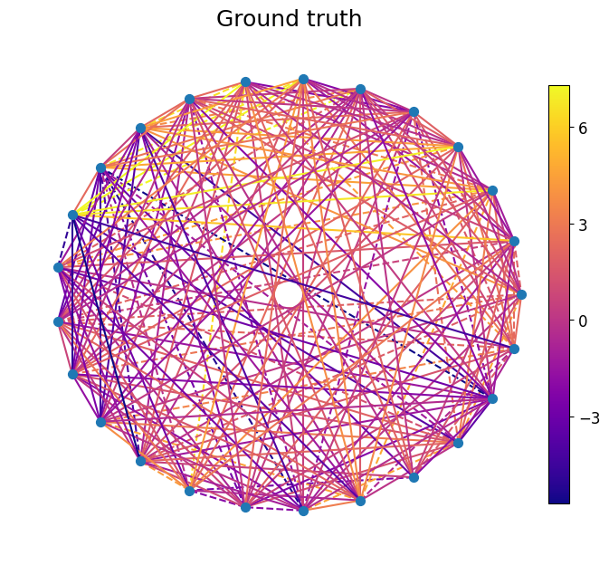
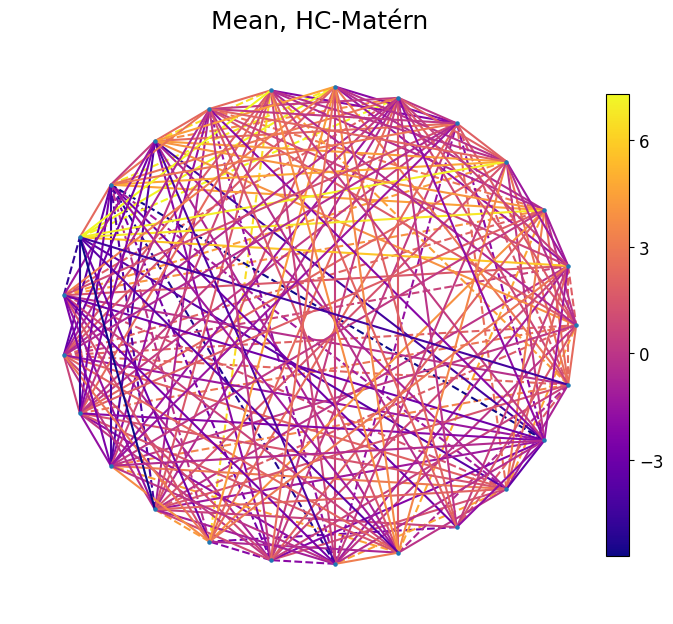

=========================================
Hodge-Compositional Edge Gaussian Process
=========================================

Hodge-compositional Gaussian processes (Hodge-GP) are used for modeling 
functions defined over the edge set of a simplicial complex. The goal of this 
tutorial is to demonstrate how to use Hodge-GP to model functions over edge 
flows to learn flow-type data on networks where the edge flows can be characterized
by discrete divergence and curl. Hodge-GP enables learning on different Hodge components
separately, allowing us to capture the behavior of edge flows.

**Gaussian processes.** A random function :math:`f : X \to \mathbb{R}` defined over 
a set :math:`X` is a Gaussian process :math:`f \sim \mathcal{GP}(\mu, k)` with mean 
function :math:`\mu(\cdot)` and kernel :math:`k(\cdot, \cdot)` if, for any finite 
et of points :math:`\mathbf{x} = (x_1, \ldots, x_n)^{\top} \in X^n`, the random 
vector :math:`f(\mathbf{x}) = (f(x_1), \ldots, f(x_n))^{\top}` is multivariate 
Gaussian with mean vector :math:`\mu(\mathbf{x})` and covariance matrix 
:math:`k(\mathbf{x}, \mathbf{x})`. The kernel :math:`k` of a *prior* encodes the 
prior knowledge about the unknown function. The mean of the kernel :math:`\mu` is 
assumed to be zero. Thus, a GP on graphs :math:`f_0 \sim \mathcal{GP}(0, K_0)` 
assumes :math:`f_0` is a random function with zero mean and a graph kernel :math:`K_0` 
which encodes the covariance between pairs of nodes.

**Edge Gaussian processes.** We can define GPs on the edges of simplicial 
2-complexes :math:`\text{SC}_{\text{2}}`, specifically, 
:math:`\boldsymbol{f}_1 \sim \mathcal{GP}(\mathbf{0}, \boldsymbol{K}_1)` 
with zero mean and edge kernel :math:`\boldsymbol{K}_1`. These are referred to as
*edge GPs*. The edge Gaussian processes (GPs) are derived from stochastic 
partial differential equations (SPDEs) on edges.

The two edge GPs can be defined as 

.. math::
    \begin{aligned}
    \label{eq:edge_gp_kernels}
    \boldsymbol{f}_{1,\text{Matérn}} &\sim \mathcal{GP}\left(\mathbf{0}, \left(\frac{2\nu}{\kappa^2} \mathbf{I} + \mathbf{L}_1\right)^{-\nu}\right), \\
    \boldsymbol{f}_{1,\text{diffusion}} &\sim \mathcal{GP}\left(\mathbf{0}, e^{-\frac{\kappa^2}{2} \mathbf{L}_1}\right),
    \end{aligned}

which are the *edge Matérn* and *diffusion* GPs, respectively. These edge GPs impose a structured prior covariance that encodes the dependencies between edges. Given the eigendecomposition in Section \ref{section:eigendecomposition}, we obtain special classes of edge GPs by using certain types of eigenvectors when building edge kernels in equation \ref{eq:edge_gp_kernels}. These types can be defined as the *gradient*, *curl* and *harmonic edge* GPs as follows

.. math::
    \boldsymbol{f}_G \sim \mathcal{GP}(\mathbf{0}, \boldsymbol{K}_G), \quad \boldsymbol{f}_C \sim \mathcal{GP}(\mathbf{0}, \boldsymbol{K}_C) \quad \boldsymbol{f}_H \sim \mathcal{GP}(\mathbf{0}, \boldsymbol{K}_H)

where the gradient kernel, curl kernel and the harmonic kernel are

.. math::
    \boldsymbol{K}_G = \boldsymbol{U}_G \boldsymbol{\Psi}_G(\boldsymbol{\Lambda}_G) \boldsymbol{U}_G^{\top}, \quad \boldsymbol{K}_C = \boldsymbol{U}_C \boldsymbol{\Psi}_C(\boldsymbol{\Lambda}_C) \boldsymbol{U}_C^{\top} \quad \boldsymbol{K}_H = \boldsymbol{U}_H \boldsymbol{\Psi}_H(\boldsymbol{\Lambda}_H) \boldsymbol{U}_H^{\top}.

**Hodge-compositional Edge GPs.** Many real-world edge functions are indeed div- or 
curl-free, but not all. We combine the gradient, curl, and harmonic GPs to define 
the Hodge-compositional (HC) edge GPs as follows. A Hodge-compositional edge Gaussian 
process :math:`\boldsymbol{f}_1 \sim \mathcal{GP}(\mathbf{0}, \boldsymbol{K}_1)` is a
sum of gradient, curl, and harmonic GPs, i.e., :math:`\boldsymbol{f}_1 = \boldsymbol{f}_G + \boldsymbol{f}_C + \boldsymbol{f}_H`, 
where

.. math::
    \boldsymbol{f}_\square \sim \mathcal{GP}(\mathbf{0}, \boldsymbol{K}_\square) \quad \text{with} \quad \boldsymbol{K}_\square = \boldsymbol{U}_\square \boldsymbol{\Psi}_\square(\boldsymbol{\Lambda}_\square) \boldsymbol{U}_\square^{\top}

for :math:`\square = H, G, C`, where their kernels do not share hyperparameters. Given this definition, 
the following property of HC edge GP holds. Let :math:`\boldsymbol{f}_1 \sim \mathcal{GP}(\mathbf{0}, \boldsymbol{K}_1)` 
be an edge GP. Its realizations then give all possible edge functions. It further holds 
that :math:`\boldsymbol{K}_1 = \boldsymbol{K}_H + \boldsymbol{K}_G + \boldsymbol{K}_C`, and 
the three Hodge GPs are mutually independent.

In this tutorial, we will demonstrate an edge-based learning task using foreign 
exchange market data.

>>> from pytspl import load_dataset
>>>
>>> # load the forex dataset
>>> sc, _, flow = load_dataset("forex")
>>>
>>> # get the flow from the dict and convert it to numpy array
>>> y = np.fromiter(flow.values(), dtype=float)
WARNING: No coordinates found.
Generating coordinates using spring layout.
Num. of nodes: 25
Num. of edges: 210
Num. of triangles: 770
Shape: (25, 210, 770)
Max Dimension: 2
Coordinates: 25
Flow: 210

Create a Hodge-GP model and fit it to the data. We pass the SC
and the flow data as input to the model.

>>> from pytspl.hodge_gp import HodgeGPTrainer
>>>
>>> # create the trainer object
>>> hogde_gp = HodgeGPTrainer(sc=sc, y=y)

Set the model parameters and split the data into training and testing sets.

>>> # set the training ratio
>>> train_ratio = 0.2
>>>
>>> # set the data normalization
>>> data_normalization = False
>>>
>>> # split the data into training and testing sets
>>> x_train, y_train, x_test, y_test, x, y  = hogde_gp.train_test_split(train_ratio=train_ratio, data_normalization=data_normalization)
x_train: (42,)
x_test: (168,)
y_train: (42,)
y_test: (168,)

In the next step, we decide the kernel type, likelihood function and model 
used in training. The kernels encode prior knowledge about the unknown function 
and can be often difficult to choose. The available kernel types
can be found under the `pytspl.hodge_gp.kernels` module. 

>>> from pytspl.hogde_gp.kernel_serializer import KernelSerializer
>>>
>>> # get the eigenpairs
>>> eigenpairs = hogde_gp.get_eigenpairs()
>>>
>>> # set the kernel parameters
>>> kernel_type = "matern" # kernel type
>>> data_name = "forex" # dataset name
>>>
>>> # serialize the kernel
>>> kernel = KernelSerializer().serialize(
>>>    eigenpairs=eigenpairs, 
>>>    kernel_type=kernel_type, 
>>>    data_name=data_name
>>> )

Specify the likelihood and the mean function for the model.

>>> import gpytorch
>>> from pytspl.hogde_gp import ExactGPModel
>>>
>>> likelihood = gpytorch.likelihoods.GaussianLikelihood()
>>> model = ExactGPModel(x_train, y_train, likelihood, kernel, mean_function=None)
>>>
>>> # view model architecture
>>> print(model)
ExactGPModel(
  (likelihood): GaussianLikelihood(
    (noise_covar): HomoskedasticNoise(
      (raw_noise_constraint): GreaterThan(1.000E-04)
    )
  )
  (mean_module): ConstantMean()
  (covar_module): ScaleKernel(
    (base_kernel): MaternKernelForex(
      (raw_kappa_down_constraint): Positive()
      (raw_kappa_up_constraint): Positive()
      (raw_kappa_constraint): Positive()
      (raw_mu_constraint): Positive()
      (raw_mu_down_constraint): Positive()
      (raw_mu_up_constraint): Positive()
      (raw_h_constraint): Positive()
      (raw_h_down_constraint): Positive()
      (raw_h_up_constraint): Positive()
    )
    (raw_outputscale_constraint): Positive()
  )
)

Specify the output device for the model and likelihood.

>>> import torch
>>> output_device = "cpu"
>>>
>>> if torch.cuda.is_available():
>>>    model = model.to(output_device)
>>>    likelihood = likelihood.to(output_device)

Train the model using the training data.

>>> # train the models
>>> model.train()
>>> likelihood.train()
>>> hogde_gp.train(model, likelihood, x_train, y_train)
Iteration 1/1000 - Loss: 5.387 
Iteration 2/1000 - Loss: 4.940 
Iteration 3/1000 - Loss: 4.554 
Iteration 4/1000 - Loss: 4.221 
...
Iteration 997/1000 - Loss: -0.170 
Iteration 998/1000 - Loss: -0.170 
Iteration 999/1000 - Loss: -0.171 
Iteration 1000/1000 - Loss: -0.171 

Evaluate the model using the testing dataset.

>>> # evaluate the model
>>> hogde_gp.predict(model, likelihood, x_test, y_test)
Test MAE: 5.07415461470373e-05
Test MSE: 4.291597299754812e-09
Test R2: 1.0
Test MLSS: -3.288797616958618
Test NLPD: -3.5441062450408936

To obtain the model's learned parameters, users can use the 
:func:`get_model_parameters` function.

>>> # get the trained model parameters
>>> hogde_gp.get_model_parameters()
{'raw_noise': 0.00010002510680351406,
 'raw_mu': 0.6931471824645996,
 'raw_mu_down': 0.6705738306045532,
 'raw_mu_up': 2.148306369781494,
 'raw_kappa': 0.6931471824645996,
 'raw_kappa_down': 39.97739791870117,
 'raw_kappa_up': 0.02517639473080635,
 'raw_h': 0.6931471824645996,
 'raw_h_down': 31.798500061035156,
 'raw_h_up': 0.053553808480501175,
 'raw_outputscale': 11.325119972229004
 }

Next, we interpolate the forex market using the test set.
The ground truth and the predicted edge flows are shown below
using the HC Matérn kernel.

References
----------

- :cite:t:`pmlr-v238-yang24e`

