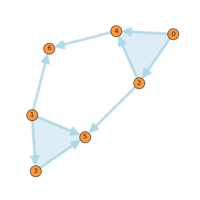

Introduction to PyTSPL
=======================

This tutorial will show you the basic functionality of the toolbox. 
After installing the package with pip, start by opening a python shell, 
e.g. a Jupyter notebook, and import the PyTSPL.

Let's start by building a simplicial complex by using the built-in dataset 
loader. Once we load the dataset, we will get a summary of the simplcial 
complex (SC). Additionally, we will get the coordinates and the flow of the SC.

Loading a SC from a dataset
---------------------------

Before loading a dataset, we can list the available datasets that are 
currently available.

>>> from pytspl import list_datasets
>>> list_datasets()
['barcelona',
 'chicago-regional',
 'siouxfalls',
 'anaheim',
 'test_dataset',
 'goldcoast',
 'winnipeg',
 'chicago-sketch',
 'paper',
 'forex',
 'lastfm-1k-artist',
 'wsn']

Now, let's load a dataset and get a summary of the simplicial complex.

>>> from pytspl import load_dataset
>>> sc, coordinates, flow = load_dataset("paper")
Num. of nodes: 7
Num. of edges: 10
Num. of triangles: 3
Shape: (7, 10, 3)
Max Dimension: 2
Coordinates: 7
Flow: 10

We can plot the network using the SCPlot module.

.. plot::
    :context: close-figs

    >>> from pytspl import SCPlot
    >>> import matplotlib.pyplot as plt
    >>>
    >>> fig, ax = plt.subplots(figsize=(4, 5))
    >>>
    >>> sc, coordinates, flow = load_dataset("paper")    
    >>> scplot = SCPlot(simplical_complex=sc, coordinates=coordinates)
    >>> scplot.draw_network(ax=ax)

We can also plot the SC with its edge flow.

.. plot::
    :context: close-figs

    >>> fig, ax = plt.subplots(figsize=(5, 5))
    >>>
    >>> scplot.draw_network(edge_flow=flow, ax=ax)

To retrive the properties of the SC, we can use the SimplicialComplex object. 
We can retrieve, for example, adjacency matrix, incidence matrices and the Hodge 
Laplacian matrices using the rank.

>>> sc.adjacency_matrix()
>>> sc.incidence_matrix(rank=1)
>>> sc.hodge_laplacian_matrix(rank=1)
array([[ 3.,  0.,  1.,  0.,  0.,  0.,  0.,  0.,  0.,  0.],
       [ 0.,  4.,  0.,  0.,  0., -1.,  0.,  0.,  0.,  0.],
       [ 1.,  0.,  3.,  0.,  0.,  0., -1.,  0.,  0.,  0.],
       [ 0.,  0.,  0.,  3., -1., -1.,  0.,  0.,  0.,  0.],
       [ 0.,  0.,  0., -1.,  3.,  1., -1.,  0.,  0.,  0.],
       [ 0., -1.,  0., -1.,  1.,  2.,  0.,  1.,  0., -1.],
       [ 0.,  0., -1.,  0., -1.,  0.,  2., -1., -1.,  0.],
       [ 0.,  0.,  0.,  0.,  0.,  1., -1.,  3.,  0.,  0.],
       [ 0.,  0.,  0.,  0.,  0.,  0., -1.,  0.,  3.,  0.],
       [ 0.,  0.,  0.,  0.,  0., -1.,  0.,  0.,  0.,  3.]])

Generate a random SC
------------------------------------

We can also generate a random SC in the following way.

>>> from pytspl import generate_random_simplicial_complex, SCPlot
>>>
>>> sc, coordinates = generate_random_simplicial_complex(
>>>        num_of_nodes=7,
>>>        p=0.25,
>>>        seed=42,
>>>        dist_threshold=0.8
>>> )
>>> scplot = SCPlot(sc, coordinates)
>>> scplot.draw_network()

