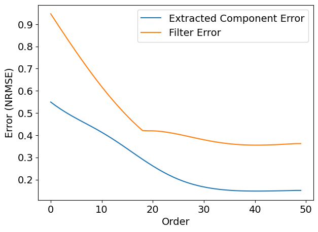
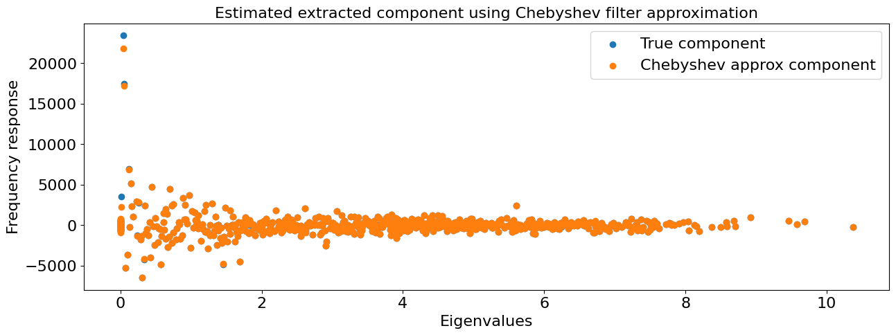
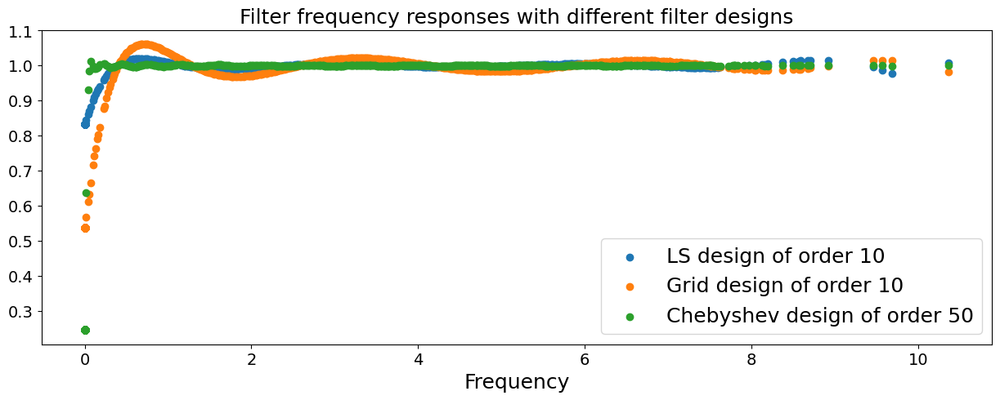
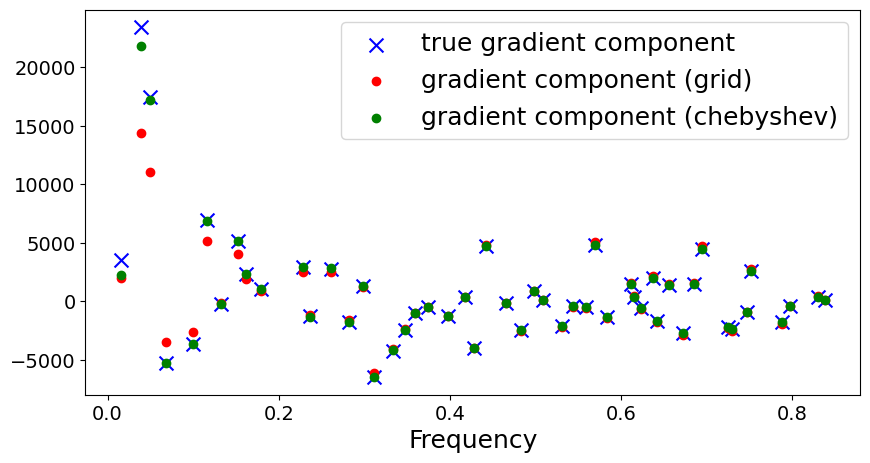

=======================
Introduction to Filters
=======================

``PyTSPL`` has functional for various filters, namely Simplicial Convolutional Filters and Simplicial Trend Filters.
The Simplicial Convolutional Filters include the following filters:

- Least-Squares (LS) Filter Design
- Grid-based Filter Design
- Chebyshev Polynomial Filter Design

Filter Designs
--------------
Given a dataset of input-output edge flow relations 
:math:`T = \{(\mathbf{f}_1, \mathbf{f}_{o, 1}), \ldots, (\mathbf{f}_{|T|}, \mathbf{f}_{o, |T|})\}`, 
we learn the filter coefficients by aligning the filter's output 
:math:`\mathbf{H_1} \mathbf{f}` with the observed output :math:`\mathbf{f}_o`. 
The filter coefficients here are learned in a data-driven manner. 
The optimization utilizes a mean squared error (MSE) cost function, 
enhanced with a regularization term :math:`r(\mathbf{f}_0, \boldsymbol{\alpha}, \boldsymbol{\beta})`, 
to prevent overfitting. The problem is formulated as:

.. math::
    \min_{h_0; \boldsymbol{\alpha}; \boldsymbol{\beta}} \frac{1}{|T|} \sum_{(\mathbf{f}_i; \mathbf{f}_o, i) \in T} \|\mathbf{H}_{1} \mathbf{f}_i - \mathbf{f}_{o;i}\|_2^2 + \gamma r(h_0, \boldsymbol{\alpha}, \boldsymbol{\beta}),

where :math:`\gamma > 0` acts as the regularization coefficient, balancing 
fit and complexity to improve model generalization.

We aim to design simplicial filters given a desired frequency response. 
First, we considered the standard least-squares (LS) filter design and 
following that, we consider a universal filter design that avoids the 
eigenvalue computation given a continuous frequency response. 
In particular, we consider grid-based and Chebyshev polynomial filter designs.

This tutorial will introduce Chebyshev Polynomial filter design. Tutorials for other filters 
can be found under `notebooks/filters`. All the filters are included in the ``pytspl.filters`` 
module.

Load the chicago-sketch dataset as a simplicial complex.

>>> from pytspl import load_dataset
>>> 
>>> # load the chicago-sketch dataset
>>> sc, coordinates, flow = load_dataset("chicago-sketch")
>>>
>>> # convert the flow to an numpy array
>>> flow = np.asarray(list(flow.values()))
Num. of nodes: 546
Num. of edges: 1088
Num. of triangles: 112
Shape: (546, 1088, 112)
Max Dimension: 2
Coordinates: 546
Flow: 1088

Plot the simplicial complex using the :func:`draw_network` function.

>>> from pytspl import SCPlot
>>>
>>> fig, ax = plt.subplots(1, 1, figsize=(80, 40))
>>>
>>> scplot = SCPlot(simplicial_complex=sc, coordinates=coordinates)
>>> scplot.draw_network(with_labels=False, node_size=200, arrowsize=20, ax=ax)

.. image:: figures/chicago-sketch-example.png

In the next step, we initialize the Chebyshev polynomial filter design.

>>> from pytspl.filters import ChebyshevFilterDesign
>>> chebyshev_filter = ChebyshevFilterDesign(simplicial_complex=sc)

Here, we can plot the Chebyshev series approximation for a matrix :math:`\textbf{P}`.
Additionally, we can define the number of points :math:`n`, the cut-off frequency,
and the steepness of the filter.

>>> chebyshev_filter.plot_chebyshev_series_approx(p_choice="L1L")

.. image:: figures/filters/cheb_series_approx.png

To apply the filter, we need to specify the matrix :math:`\textbf{P}`, the component to 
extract, the filter size, the cut-off frequency, the steepness, and the number of points
to approximate the Chebyshev series.

>>> # apply the Chebyshev filter
>>> filter_size = 50
>>>
>>> chebyshev_filter.apply(
>>>    f=flow, 
>>>    p_choice="L1L", 
>>>    component="gradient", 
>>>    L=filter_size, 
>>>    cut_off_frequency=0.01, 
>>>    steep=100, 
>>>    n=100
>>> )
Filter size: 0 - Error: 0.5494 - Filter error: 0.9471 - Error response: 0.9489
Filter size: 1 - Error: 0.5326 - Filter error: 0.9120610332448 - Error response: 0.9234254397938262
Filter size: 2 - Error: 0.5168 - Filter error: 0.8772 - Error response: 0.9016
Filter size: 3 - Error: 0.5023 - Filter error: 0.8427 - Error response: 0.8785
Filter size: 4 - Error: 0.4887 - Filter error: 0.8087 - Error response: 0.8527
...
Filter size: 45 - Error: 0.1495 - Filter error: 0.3583 - Error response: 0.5850
Filter size: 46 - Error: 0.1500 - Filter error: 0.3595 - Error response: 0.5851
Filter size: 47 - Error: 0.1506 - Filter error: 0.3608 - Error response: 0.5852
Filter size: 48 - Error: 0.1512 - Filter error: 0.3621 - Error response: 0.5854
Filter size: 49 - Error: 0.1512 - Filter error: 0.3621 - Error response: 0.5854

Plot the extracted component and filter error.

>>> # plot the extracted component and filter error
>>> fig, ax = plt.subplots(1, 1, figsize=(10, 5))
>>> 
>>> plt.plot(chebyshev_filter.history["extracted_component_error"])
>>> plt.plot(chebyshev_filter.history["filter_error"])
>>> plt.legend(["Extracted Component Error", "Filter Error"])

Plot the approximated frequency responses of the built filter.

>>> chebyshev_filter.plot_frequency_response_approx(flow=flow, component="gradient")

After applying the filter, we can retrieve the history of the filter.
The history contains the:

- *filter*: the filter for each filter size
- *f_estimated*: the estimated flow after applying the filter
- *frequency_responses*: the frequency responses for each filter size
- *extracted_component_error*: the extracted component error for each filter size
- *filter_error*: the filter error for each filter size

>>> # retrieve the history of the filter
>>> cheb_filter.history
{'filter': array([[[ 9.60182326e-01,  6.52287870e-03,  6.52287870e-03, ...,
           0.00000000e+00,  0.00000000e+00,  0.00000000e+00],
         [ 6.52287870e-03,  9.60182326e-01,  0.00000000e+00, ...,
           0.00000000e+00,  0.00000000e+00,  0.00000000e+00],
         [ 6.52287870e-03,  0.00000000e+00,  9.60182326e-01, ...,
...

To compare the three filter designs, we applied them to the Chicago road network. For the LS-based filter design, 
we set a filter order of 10. Setting a low filter order avoids the ill-conditioning. For the grid-based filter design, 
we uniformly sampled 100 points in the interval :math:`[0, \lambda_{G,\text{max}}]` with :math:`\lambda_{G,\text{max}} = 10.8` 
approximated using the power-iteration algorithm with steps = 50. The cut-off frequency :math:`\lambda_{0} = 0.01` and the steep 
:math:`k = 100` for the logistic function in the Chebyshev polynomial design.

The Chebyshev polynomial of order 50 only has a couple of frequencies smaller than 0.9 at the smallest gradient frequency. 
The remaining frequencies can preserve the gradient component well. The LS-based and grid-based filter designs have 
a poorer performance, especially at small gradient frequencies. 

We can calculate the SFT of the extracted gradient component and compare it with the grid-based filter design. 
The comparison is plotted below. As we can see, the Chebyshev polynomial filter has a good extraction ability and 
performs well at very small frequencies where the grid-based design fails.

References
----------

- :cite:t:`yang2022simplicial`
- The library utilizes the chebpy Python library for Chebyshev series approximation. For more information, see the `GitHub repository <https://github.com/chebpy/chebpy>`_.

