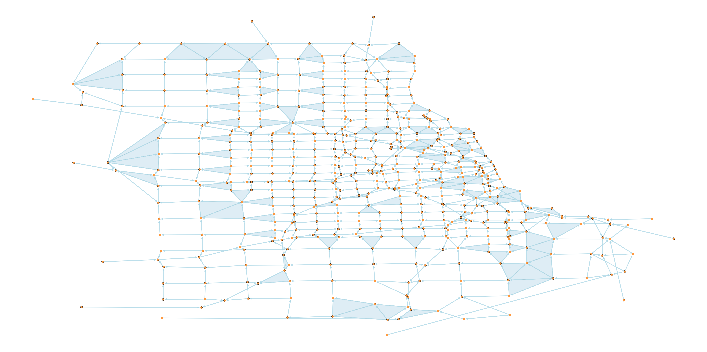

=======================
Introduction to Filters
=======================

``PyTSPL `` has functional for various filters, namely Simplicial Convolutional Filters and Simplicial Trend Filters.
The Simplicial Convolutional Filters include the following filters:

- Least Squares Filter Design
- Grid-based Filter Design
- Chebyshev Filter Design

This tutorial will introduce Chebyshev Filter Design. The tutorials to the other filters 
can be found under `notebooks/filters`. All the filters are under the ``pytspl.filters`` 
module.

First, we load the chicago-sketch dataset as a simplicial complex.

>>> from pytspl import load_dataset
>>> sc, coordinates, flow = load_dataset("chicago-sketch")
Num. of nodes: 546
Num. of edges: 1088
Num. of triangles: 112
Shape: (546, 1088, 112)
Max Dimension: 2
Coordinates: 546
Flow: 1088

We can plot the simplicial complex using the :func:`draw_network` function.

>>> from pytspl import SCPlot
>>>
>>> fig, ax = plt.subplots(1, 1, figsize=(80, 40))
>>>
>>> scplot = SCPlot(simplical_complex=sc, coordinates=coordinates)
>>> scplot.draw_network(with_labels=False, node_size=200, arrowsize=20, ax=ax)

In the next step, we initialize the Chebyshev Filter Design object. 

>>> from pytspl.filters import ChebyshevFilterDesign
>>> cheb_filter = ChebyshevFilterDesign(simplicial_complex=sc)

Here, we can plot the Chebyshev Series approximation for a matrix :math:`\textbf{P}`.

>>> chebfilter.plot_chebyshev_series_approx(p_choice="L1L")

.. image:: figures/filters/cheb_series_approx.png

Now, we apply the filter. Since the flow is a dictionary, we need to convert it to 
a numpy array.

>>> # convert the flow to an numpy array
>>> flow = np.asarray(list(flow.values()))
>>>
>>> filter_size = 50
>>>
>>> cheb_filter.apply(
>>>    f=flow, 
>>>    p_choice="L1L", 
>>>    component="gradient", 
>>>    L=filter_size, 
>>>    cut_off_frequency=0.01, 
>>>    steep=100, 
>>>    n=100
>>> )
Filter size: 0 - Error: 0.5494619166258772 - Filter error: 0.9471365686992458 - Error response: 0.9489898323947535
Filter size: 1 - Error: 0.532557939091598 - Filter error: 0.9120610332448 - Error response: 0.9234254397938262
Filter size: 2 - Error: 0.5168884419480372 - Filter error: 0.87723439038983 - Error response: 0.9015802786095606
Filter size: 3 - Error: 0.5023187318262068 - Filter error: 0.842753739614908 - Error response: 0.8785306179474927
Filter size: 4 - Error: 0.48874350313993026 - Filter error: 0.8087137541025826 - Error response: 0.8527454858564391
...
Filter size: 45 - Error: 0.1495502629377592 - Filter error: 0.35835486651348664 - Error response: 0.5850168421212085
Filter size: 46 - Error: 0.15006892869682445 - Filter error: 0.3595667485007222 - Error response: 0.5850843615010229
Filter size: 47 - Error: 0.15063345733890043 - Filter error: 0.36086052564333454 - Error response: 0.5852038737362639
Filter size: 48 - Error: 0.15123464345417265 - Filter error: 0.362192362318501 - Error response: 0.5854072247946369
Filter size: 49 - Error: 0.15123464345417265 - Filter error: 0.362192362318501 - Error response: 0.5854072247946369

Plot the extracted component and filter error.

>>> fig, ax = plt.subplots(1, 1, figsize=(10, 5))
>>> 
>>> plt.plot(cheb_filter.history["extracted_component_error"])
>>> plt.plot(cheb_filter.history["filter_error"])
>>> plt.legend(["Extracted Component Error", "Filter Error"])

.. image:: figures/filters/chebyshev_error.png

Finally, plot the frequency response approximation of the filter.

>>> cheb_filter.plot_frequency_response_approx(flow=flow, component="gradient")

.. image:: figures/filters/cheb_freq_response.png

After applying the filter, we can retrieve the history of the filter.
The history contains the:

- *filter*: the filter for each filter size
- *f_estimated*: the estimated flow after applying the filter
- *frequency_responses*: the frequency responses for each filter size
- *extracted_component_error*: the extracted component error for each filter size
- *filter_error*: the filter error for each filter size

>>> cheb_filter.history
{'filter': array([[[ 9.60182326e-01,  6.52287870e-03,  6.52287870e-03, ...,
           0.00000000e+00,  0.00000000e+00,  0.00000000e+00],
         [ 6.52287870e-03,  9.60182326e-01,  0.00000000e+00, ...,
           0.00000000e+00,  0.00000000e+00,  0.00000000e+00],
         [ 6.52287870e-03,  0.00000000e+00,  9.60182326e-01, ...,
...
